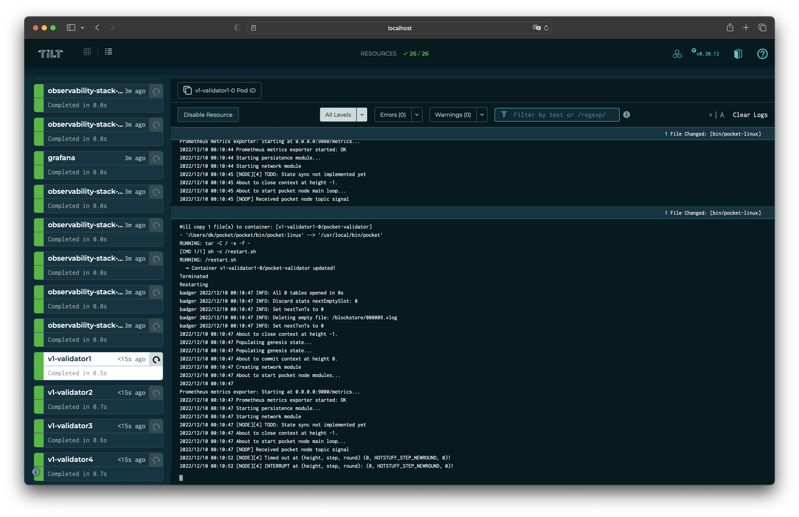

# LocalNet on Kubernetes

We are developing our own Kubernetes operator to manage v1 workloads both internally and for the community to make it easier to deploy pocket v1. While the operator is still in development, we can already utilize it to run our local networks locally on Kubernetes. This guide will show you how to do that.

- [LocalNet on Kubernetes](#localnet-on-kubernetes)
    - [Dependencies](#dependencies)
    - [Running the localnet](#running-the-localnet)
    - [Stopping / cleaning up the resources](#stopping--cleaning-up-the-resources)
    - [How does it work?](#how-does-it-work)
    - [Troubleshooting](#troubleshooting)

### Dependencies

* [tilt](https://docs.tilt.dev/install.html)
* Kubernetes cluster ([different options available](https://docs.tilt.dev/choosing_clusters.html)), please make sure to run 1.23 version or older, until [this issue is resolved](https://github.com/zalando/postgres-operator/issues/2098) - otherwise Postgres DB is not going to be provisioned.
  * `kubectl` is also required to be installed and configured to access the cluster, but that should happen automatically when you install kubernetes cluster locally.
  * `helm` is required to template the yaml manifests for the observability stack. Here are the instructions on how to install it: https://helm.sh/docs/intro/install/.
* pocket kubernetes operator codebase in `../pocket-operator` directory, relative to the pocket v1 codebase. If you don't have it, tilt will try to pull it from the `main` branch on first launch.
  * Having this codebase available on your computer allows you to iterate/change the operator code while running the localnet.

### Running the localnet

Start the LocalNet with `make localnet_up` command - this will start tilt. Tilt will prompt to press `space` to open a browser window with the UI where you can see the logs of all services running (including the operator, observability stack, etc.). You can also open the UI by going to `http://localhost:10350/` in your browser.

### Stopping / cleaning up the resources

`make localnet_down` will stop the localnet and clean up all the resources, except the postgres operator (in case you have other databases provisioned with it, the database itself will be destroyed).

### How does it work?

`tilt` reads the `Tiltfile` in the root of the project, and based on the configuration in it, it will start the services defined in the `Tiltfile` and will monitor the files for changes. `Tiltfile` is written in Starlark, which is a dialect of Python.

Currently, the services defined in the `Tiltfile` are:
- [pocket-operator](https://github.com/pokt-network/pocket-operator) - the operator that manages the v1 workloads;
  - once operator is available, `tilt` pushes a set of Custom Resource Definitions (CRDs) to the cluster to provision the genesis file (localnet configuration), and [validators](../../build/localnet/validators.yaml);
- [postgres-operator](https://github.com/zalando/postgres-operator) - the operator to manage postgres lifecycle in kubernetes;
  - once operator is available, `tilt` pushes a [Postgres CRD](../../build/localnet/postgres-database.yaml) to the cluster to provision a postgres database;
- [obeservability-stack](../../build/localnet/observability-stack/) - a helm chart that installs the observability stack (prometheus, grafana, etc.) that is used to gather metrics and logs from localnet services.
- v1 cli client - this is a binary that can be used to perform operations on testnet, e.g. you can run `make localnet_client_debug` to execute commands such as `ResetToGenesis`, or `TogglePacemakerMode`. This binary is also automatically updated when you make changes to the codebase.

Tilt continuously monitors files on local filesystem, and when it detects a change, it will rebuild the binary once and distribute it to all the pods that are running. This allows you to iterate on the code and see the changes immediately.
This works for both - pocket v1 codebase, and pocket-operator codebase that lives in a separate repo/directory.

The workloads however are not managed by Tilt directly, but by the pocket-operator. Tilt instructs pocket-operator by pushing the CRDs to the cluster, and the operator takes care of the rest. This allows us to test and validate pocket-operator, however if we notice this set up introduces too much friction - we will modify the `Tiltfile` to manage the workloads on kubernetes directly.

### Troubleshooting

Sometimes you might experience issues running localnet on Kubernetes. They might be related to the fact different people run different clusters/OS/environments, and sometimes our laptops can go to sleep and that might not play well with virtual machines, postgres or pocket client.

- Check tilt web UI by pressing a space in the terminal where you started tilt or going to [this page](http://localhost:10350/) in your browser. If you see any errors, you can click "Trigger Update" on a resource that has issues to restart the service or retry a command.
- If triggering an update didn't help, please try to run `make localnet_down` and then `make localnet_up` again. This will clean up most of the resources and start the localnet from scratch.
- If `make localnet_down` didn't help, we suggest to rebuild local kubernetes cluster using the tool you're managing your cluster with - it could be Docker Desktop, Rancher Desktop, k3s, k3d, minikube, etc.
- Open an issue in this repo if you're still experiencing issues with running localnet using this guide.
